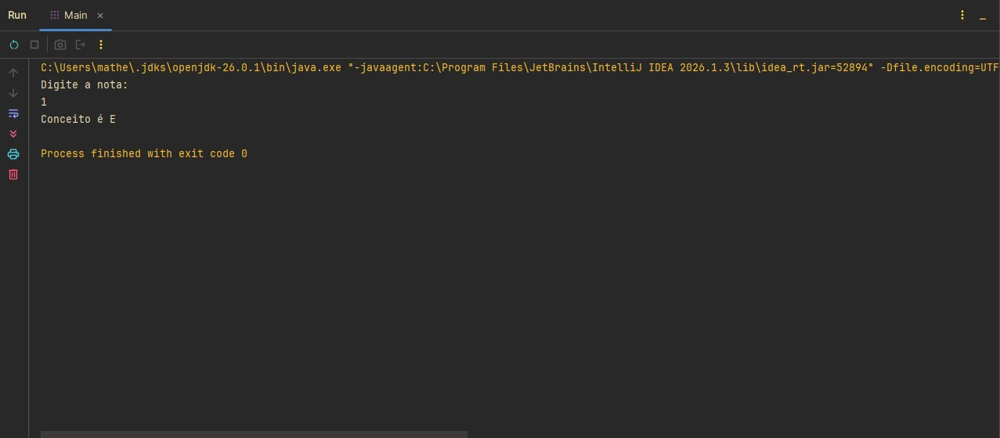

# Classificação de Conceitos com `switch` em Java

Projeto desenvolvido durante meus estudos de **Java** com o objetivo de praticar a estrutura de decisão `switch`, a utilização da instrução `break` e o controle de fluxo utilizando a linguagem.

## Sobre este repositório

Este repositório faz parte da minha jornada de aprendizado em Java. Meu objetivo é documentar os principais exercícios e desafios desenvolvidos ao longo dos estudos, registrando minha evolução na linguagem e construindo um portfólio para oportunidades de estágio e desenvolvimento de software.

## Descrição

O programa solicita ao usuário uma nota inteira entre **0 e 10** e, por meio da estrutura `switch`, determina o conceito correspondente.

A classificação utilizada é:

|   Nota | Conceito |
| -----: | :------: |
| 9 – 10 |     A    |
|  7 – 8 |     B    |
|  5 – 6 |     C    |
|  3 – 4 |     D    |
|  0 – 2 |     E    |

Caso seja informada uma nota fora desse intervalo, o programa exibe a mensagem **"Não informado!"**.

### Estrutura `switch`

O programa utiliza a estrutura de decisão `switch` para associar diferentes valores de entrada aos respectivos conceitos.

Também é utilizado o agrupamento de múltiplos `case`, permitindo que diferentes notas resultem no mesmo conceito sem a necessidade de repetir código.

### Utilização da instrução `break`

Cada bloco do `switch` é finalizado com a instrução `break`, responsável por interromper a execução da estrutura após a atribuição do conceito correspondente.

Essa abordagem evita que os casos seguintes sejam executados indevidamente, garantindo o comportamento esperado do programa.

## Tecnologias e conceitos utilizados

* IntelliJ IDEA
* Java
* Scanner
* Estrutura de decisão `switch`
* Instrução `break`
* Agrupamento de casos (`case`)
* Variáveis
* Entrada e saída de dados

## Demonstração

<p align="center">
  
</p>

<p align="center">
  
</p>

## Estrutura do projeto

```text
java-switch-conceitos/
│
├── images/
│   ├── captura1.jpg
│   └── captura2.jpg
│
├── Main.java
│
└── README.md
```

## Objetivo

Praticar conceitos fundamentais da linguagem Java, especialmente:

* utilização da estrutura de decisão `switch`;
* agrupamento de múltiplos `case` para um mesmo resultado;
* utilização da instrução `break` para interromper a execução do `switch`;
* manipulação de variáveis;
* entrada e saída de dados utilizando a classe `Scanner`.

## Aprendizados

Durante o desenvolvimento deste exercício, pratiquei:

* construção de estruturas de decisão utilizando `switch`;
* utilização da instrução `break` para controlar o fluxo de execução;
* agrupamento de casos que compartilham o mesmo comportamento;
* associação de valores de entrada a diferentes resultados;
* organização básica de programas em Java.

## Como executar

Clone este repositório:

```bash
git clone https://github.com/SEU-USUARIO/java-switch-conceitos.git
```

Acesse a pasta do projeto:

```bash
cd java-switch-conceitos
```

Compile o programa:

```bash
javac Main.java
```

Execute:

```bash
java Main
```

## Autor

**Matheus Ferreira Lopes**

Estudante de Desenvolvimento de Software Multiplataforma (FATEC Diadema)

